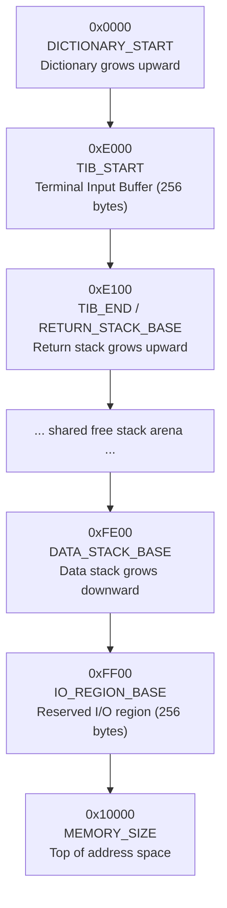

# rforth


A minimal, portable, Forth language interpreter that is implemented in Rust. The interpreter core is
`no_std` and platform-agnostic; platform selection happens at compile time via `cfg` attributes and
the `embedded` Cargo feature flag.

## Status

Early implementation. The reusable virtual machine now installs the classic irreducible stage-zero
core plus the first source-driven bootstrap layer: threaded inner-interpreter words, `QUIT`,
`BYE`, `ABORT`, `?ABORT`, basic stack and memory primitives, arithmetic/comparison words, source
compiler words `:` / `;`, and `KEY` / `EMIT` / `.`. The runner now supports:

- interactive TTY mode with prompts and local echo
- simple interactive backspace/delete editing at the end of the current line
- batch stdin mode for a piped or redirected Forth source
- signed decimal literals and source-defined colon words
- basic Forth source comments with `\` and whitespace-delimited `( ... )`
- stderr diagnostics with nonzero Unix exit codes on batch failures

## Building and running

```bash
cargo build          # build
cargo run            # run the interpreter (Unix only)
printf ': ONE 1 ; ONE .\n' | cargo run   # run a Forth source snippet through stdin
cargo test           # run the default test suite
scripts/check-ci.sh  # format, test, and lint all VM variants
```

## Testing

Tests are host-side Rust tests that exercise the reusable library crate. The tokenizer tests cover
allocation-free word parsing, capacity handling, and `WordVec` behavior. The interpreter tests use a
scripted `ForthIo` implementation to drive both the outer interpreter loop and the virtual machine
words without touching the terminal or raw syscalls. Batch-mode tests also feed actual `.fth` source
fixtures through stdin semantics and check stdout, stderr, and exit-code behavior.

Run the default test suite with:

```bash
cargo test
```

Run the full VM feature matrix with formatting and linting:

```bash
scripts/check-ci.sh
```

## Coverage

CI measures test coverage with
[`cargo-llvm-cov`](https://github.com/taiki-e/cargo-llvm-cov), generates `assets/coverage.svg`,
and commits the updated badge on pushes to `main`.

The badge intentionally tracks the testable interpreter core and tokenizer:

- included: `src/lib.rs`, `src/tokenizer.rs`, and tests under `tests/`
- excluded: `src/main.rs`, `src/io/*`, and `src/sys/*`

The excluded files are the runtime entrypoint, terminal I/O, and raw syscall glue. Those paths need
platform or integration tests rather than host-side unit tests, so excluding them keeps the badge
focused on the code currently covered by automated tests.

To measure badge coverage locally, install `cargo-llvm-cov` and run:

```bash
cargo llvm-cov --lib --tests --ignore-filename-regex 'src/(main.rs|io/.*|sys/.*)' --lcov --output-path lcov.info
scripts/generate-coverage-badge.sh lcov.info assets/coverage.svg
```

For an unscoped coverage report across all instrumented source files, omit the ignored regex:

```bash
cargo llvm-cov --lib --tests --lcov --output-path lcov.info
```

## Platform support

| Target                           | Status        | Notes                                     |
|----------------------------------|---------------|-------------------------------------------|
| Unix (default)                   | Working       | Raw-mode terminal I/O via `libc` syscalls |
| Embedded (`--features embedded`) | Stub          | Not yet implemented                       |
| Windows                          | Not Supported | Not Supported                             |

## Architecture

```
lib.rs          — no_std interpreter core and reusable modules
main.rs         — no_std / no_main entry point; constructs SystemIo and calls run_forth()
io/             — ForthIo trait + SystemIo struct; platform impls in unix_io.rs / embedded_io.rs
sys/            — SysCalls trait + raw syscall wrappers; unix_sys.rs / embedded_sys.rs
vm.rs           — flat-memory Forth VM state, stacks, memory access, and I/O dispatch
words/          — stage-zero word registration and grouped primitive implementations
```

The interpreter core (`run_forth`) is platform-agnostic and communicates with the outside world
exclusively through the `ForthIo` trait (`emit`, `emit_error`, `key`, and `read_key`). The `io`
layer depends on the `sys` layer for the actual syscalls, keeping the two concerns separate.

`SystemIo` detects whether stdin is interactive. Interactive terminals are switched into raw mode
(no canonical processing, no echo, `VMIN=1 VTIME=0`) and restored automatically on a drop. Non-TTY
stdin stays in batch mode, so piped source files can be consumed until EOF without prompts or echo.

The VM uses typed aliases for `MemoryWord`, `Cell`, and `Address`; `MEMORY_SIZE` is derived from
the address type. All VM layout and I/O values are named constants. The default VM profile is
direct memory-mapped I/O; `vm-uart`, `vm-port-io`, and their combination selects the alternate UART
and port-mapped models. The stage-zero engine installs dictionary-resident primitive words and can
execute colon definitions through the inner interpreter using the instruction pointer (`IP`), work
register (`W`), and compile pointer (`P`) machine state. The source interpreter now compiles colon
definitions by creating dictionary entries whose runtime code field dispatches through `DOCOL`.

The current VM memory layout is:



This layout keeps the dictionary and source buffer low in memory and reserves a shared 
opposing-stack arena in the middle. It also pins a dedicated input/output region at the top of the 
address space so device-facing addresses stay stable as the dictionary grows regardless of the
active I/O model.

## Wiki

A [wiki](https://github.com/joshua-maros/rforth/wiki) is available containing supporting
documentation.

## Dependencies

Intentionally near-zero. The [`libc`](https://crates.io/crates/libc) is the only external crate,
restricted to `[target.'cfg(unix)'.dependencies]`.

## License

This project is licensed under the [Unlicense](https://unlicense.org). See the [LICENSE](LICENSE)
file for details.
